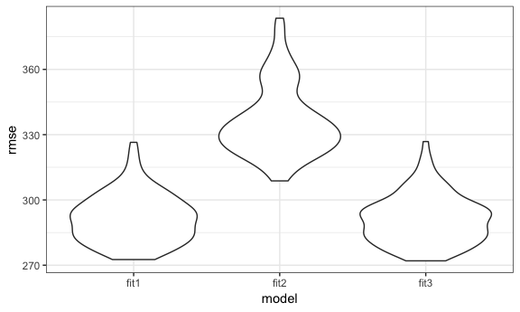
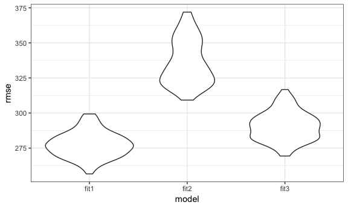

p8105\_hw6\_xy2397
================
Xue Yang
11/20/2018

Problem 1
---------

**Load and clean the data**

``` r
# load the data
homicide = read_csv(file = "./data/homicide-data.csv") 
```

``` r
homicide = 
  homicide %>% 
  # create a city_state variabl
  unite(city_state, city, state, sep = ",") %>% 
  # create a binary variable which "0" indicates homicide is unsolved, "1" solved
  mutate(resolved = as.numeric(disposition == "Closed by arrest"))  

homicide_df = 
  homicide %>%
  mutate(city_state = as.factor(city_state)) %>% 
  # omit some cities
  filter(!(city_state %in% c("Dallas,TX", "Phoenix,AZ", "Kansas City,MO", "Tulsa,AL"))) %>% 
  # modify victim_race to have categories white and non-white, with white as the reference category
  # include the "unknown" victim_race to be non-white category
  mutate(victim_race = ifelse(victim_race == "White", "white", "non-white"),
         victim_race = as.factor(victim_race),
         victim_race = relevel(victim_race, ref = "white")) %>% 
  # change victim_age to numeric, and omit the NA
  mutate(victim_age = as.numeric(victim_age)) %>% 
  filter(!is.na(victim_age))
```

    ## Warning in evalq(as.numeric(victim_age), <environment>): NAs introduced by
    ## coercion

**Fit the logistic regression model**

Obtain the estimate and confidence interval of the adjusted odds ratio for solving homicides comparing non-white victims to white victims keeping all other variables fixed.

``` r
baltimore_df = 
  homicide_df %>% 
  filter(city_state == "Baltimore,MD") %>% 
  select(resolved, victim_race, victim_age, victim_sex)

fit = glm(resolved ~ victim_age + victim_sex + victim_race,
          data = baltimore_df,
          family = binomial)

fit %>% 
  broom::tidy() %>% 
  mutate(OR = exp(estimate),
         conf_low = exp(confint(fit, level = 0.95))[,1],
         conf_high = exp(confint(fit, level = 0.95))[,2]) %>% 
  knitr::kable(digits = 3)
```

    ## Waiting for profiling to be done...
    ## Waiting for profiling to be done...

| term                    |     estimate|    std.error|     statistic|      p.value|        OR|   conf\_low|                                                                                                                                                                                          conf\_high|
|:------------------------|------------:|------------:|-------------:|------------:|---------:|-----------:|---------------------------------------------------------------------------------------------------------------------------------------------------------------------------------------------------:|
| (Intercept)             |        1.186|        0.235|         5.055|        0.000|     3.274|       2.076|                                                                                                                                                                                               5.212|
| victim\_age             |       -0.007|        0.003|        -2.142|        0.032|     0.993|       0.987|                                                                                                                                                                                               0.999|
| victim\_sexMale         |       -0.888|        0.136|        -6.525|        0.000|     0.412|       0.315|                                                                                                                                                                                               0.537|
| victim\_racenon-white   |       -0.820|        0.175|        -4.694|        0.000|     0.441|       0.312|                                                                                                                                                                                               0.620|
| From the results, we kn |  ow that the|  exp(estimat|  e) for victi|  m\_racenon-|  white in|  dicate the|  differences non-white victims to white victims of adjusted odds ratio for solving homicides, keeping all the other variables fixed. In this way, we can filter the term to "victim\_racenon-white"|

``` r
fit %>% 
  broom::tidy() %>% 
  mutate(OR = exp(estimate),
         conf_low = exp(confint(fit, level = 0.95))[,1],
         conf_high = exp(confint(fit, level = 0.95))[,2]) %>% 
  filter(term == "victim_racenon-white") %>% 
  mutate(city_state = "Baltimore,MD") %>% 
  select(city_state, OR, conf_low, conf_high) %>% 
  knitr::kable(digits = 3)
```

    ## Waiting for profiling to be done...
    ## Waiting for profiling to be done...

| city\_state     |        OR|    conf\_low|                                                                                                                                        conf\_high|
|:----------------|---------:|------------:|-------------------------------------------------------------------------------------------------------------------------------------------------:|
| Baltimore,MD    |     0.441|        0.312|                                                                                                                                              0.62|
| The above is th |  e estima|  te and conf|  idence interval of the adjusted odds ratio for solving homicides comparing non-white victims to white victims keeping all other variables fixed.|

Now run glm for each of the cities in your dataset.

``` r
# create a function of city to gain the OR and confidence interval 
logistic_fit = function(city){
  
  city_data = 
    homicide_df %>% 
    filter(city_state == city) %>% 
    select(resolved, victim_race, victim_age, victim_sex)

  
  fit = 
    glm(resolved ~ victim_age + victim_sex + victim_race, 
        data = city_data, 
        family = binomial) 
    
  
  result = 
    fit %>%
    broom::tidy() %>% 
    mutate(OR = exp(estimate),
           conf_low = exp(confint(fit, level = 0.95))[,1],
           conf_high = exp(confint(fit, level = 0.95))[,2]) %>% 
    filter(term == "victim_racenon-white") 
  
  result
  
}
```

``` r
# identify city
city = 
  homicide_df %>% 
  count(city_state) %>% 
  unnest()

# use the function created above to calculate for each city
output = 
  tibble(city = city$city_state) %>% 
  mutate(estimates = purrr::map(.x = city, ~logistic_fit(city = .x))) %>%
  unnest() %>% 
  select(-term)

# tidy the output
output %>% 
  select(city, OR, conf_low, conf_high) %>% 
  knitr::kable(digits = 3)
```

| city                |       OR|    conf\_low|                                    conf\_high|
|:--------------------|--------:|------------:|---------------------------------------------:|
| Albuquerque,NM      |    0.741|        0.449|                                         1.215|
| Atlanta,GA          |    0.753|        0.424|                                         1.299|
| Baltimore,MD        |    0.441|        0.312|                                         0.620|
| Baton Rouge,LA      |    0.668|        0.304|                                         1.405|
| Birmingham,AL       |    1.039|        0.612|                                         1.754|
| Boston,MA           |    0.115|        0.043|                                         0.259|
| Buffalo,NY          |    0.390|        0.210|                                         0.710|
| Charlotte,NC        |    0.558|        0.313|                                         0.951|
| Chicago,IL          |    0.562|        0.432|                                         0.734|
| Cincinnati,OH       |    0.318|        0.180|                                         0.541|
| Columbus,OH         |    0.855|        0.634|                                         1.153|
| Denver,CO           |    0.602|        0.358|                                         1.008|
| Detroit,MI          |    0.651|        0.487|                                         0.869|
| Durham,NC           |    1.003|        0.390|                                         2.452|
| Fort Worth,TX       |    0.838|        0.553|                                         1.264|
| Fresno,CA           |    0.448|        0.222|                                         0.846|
| Houston,TX          |    0.873|        0.698|                                         1.090|
| Indianapolis,IN     |    0.505|        0.381|                                         0.665|
| Jacksonville,FL     |    0.658|        0.502|                                         0.862|
| Las Vegas,NV        |    0.755|        0.586|                                         0.972|
| Long Beach,CA       |    0.794|        0.379|                                         1.606|
| Los Angeles,CA      |    0.666|        0.481|                                         0.916|
| Louisville,KY       |    0.392|        0.257|                                         0.590|
| Memphis,TN          |    0.782|        0.519|                                         1.160|
| Miami,FL            |    0.576|        0.377|                                         0.881|
| Milwaukee,wI        |    0.632|        0.398|                                         0.982|
| Minneapolis,MN      |    0.646|        0.341|                                         1.204|
| Nashville,TN        |    0.899|        0.652|                                         1.234|
| New Orleans,LA      |    0.466|        0.294|                                         0.737|
| New York,NY         |    0.531|        0.271|                                         0.988|
| Oakland,CA          |    0.213|        0.099|                                         0.418|
| Oklahoma City,OK    |    0.681|        0.477|                                         0.970|
| Omaha,NE            |    0.169|        0.091|                                         0.298|
| Philadelphia,PA     |    0.644|        0.485|                                         0.850|
| Pittsburgh,PA       |    0.282|        0.157|                                         0.485|
| Richmond,VA         |    0.447|        0.144|                                         1.150|
| Sacramento,CA       |    0.781|        0.443|                                         1.348|
| San Antonio,TX      |    0.689|        0.459|                                         1.026|
| San Bernardino,CA   |    0.880|        0.394|                                         1.999|
| San Diego,CA        |    0.483|        0.294|                                         0.778|
| San Francisco,CA    |    0.458|        0.288|                                         0.719|
| Savannah,GA         |    0.596|        0.275|                                         1.258|
| St. Louis,MO        |    0.577|        0.405|                                         0.819|
| Stockton,CA         |    0.376|        0.193|                                         0.713|
| Tampa,FL            |    1.159|        0.585|                                         2.293|
| Tulsa,OK            |    0.602|        0.411|                                         0.876|
| Washington,DC       |    0.510|        0.250|                                         0.989|
| In the table above, |  we gain|  the datafra|  me with estimated ORs and CIs for each city.|

**Create a plot**

Create a plot shows the estimated ORs and CIs for each city.

``` r
output %>% 
  # organize cities according to estimated OR
  mutate(city = forcats::fct_reorder(city, OR)) %>% 
  ggplot(aes(x = city, y = OR, color = city)) +
  geom_errorbar(aes(ymin = conf_low, ymax = conf_high)) +
  labs(
    title = "ORs and CIs for City",
    x = "City",
    y = "ORs and CIs"
  ) +
  viridis::scale_color_viridis(
    name = "City",
    discrete = TRUE
  ) +
  theme(legend.position = "none") +
  theme(axis.text.x = element_text(angle = 90, hjust = 1)) 
```

 From the plot, we can find that city "Boston, MA" has the lowest adjusted odds ratio for solving homicides comparing non-white victims to white victims keeping all other variables fixed, while "Tampa, FL" has the highest. And for more than a half city, OR&lt;1, which means that the odds of solving homicides in "non-white" victims is less than the odds in "white" victim.

Problem 2
---------

**Load and clean the data**

``` r
birthweight = read_csv(file = "./data/birthweight.csv") 
```

    ## Parsed with column specification:
    ## cols(
    ##   .default = col_integer(),
    ##   gaweeks = col_double(),
    ##   ppbmi = col_double(),
    ##   smoken = col_double()
    ## )

    ## See spec(...) for full column specifications.

Firstly, we change variables "babysex", "frace", "malform" and "mrace" into factor variables.

``` r
# change some varibles from numeric to factors
birthweight %>% 
  mutate(babysex = as.factor(babysex),
         frace = as.factor(frace),
         malform = as.factor(malform),
         mrace = as.factor(mrace))  
```

    ## # A tibble: 4,342 x 20
    ##    babysex bhead blength   bwt delwt fincome frace gaweeks malform menarche
    ##    <fct>   <int>   <int> <int> <int>   <int> <fct>   <dbl> <fct>      <int>
    ##  1 2          34      51  3629   177      35 1        39.9 0             13
    ##  2 1          34      48  3062   156      65 2        25.9 0             14
    ##  3 2          36      50  3345   148      85 1        39.9 0             12
    ##  4 1          34      52  3062   157      55 1        40   0             14
    ##  5 2          34      52  3374   156       5 1        41.6 0             13
    ##  6 1          33      52  3374   129      55 1        40.7 0             12
    ##  7 2          33      46  2523   126      96 2        40.3 0             14
    ##  8 2          33      49  2778   140       5 1        37.4 0             12
    ##  9 1          36      52  3515   146      85 1        40.3 0             11
    ## 10 1          33      50  3459   169      75 2        40.7 0             12
    ## # ... with 4,332 more rows, and 10 more variables: mheight <int>,
    ## #   momage <int>, mrace <fct>, parity <int>, pnumlbw <int>, pnumsga <int>,
    ## #   ppbmi <dbl>, ppwt <int>, smoken <dbl>, wtgain <int>

Then by checking for the missing data, we find that there is no missing data in the dataset.

``` r
# check for missing data
table(is.na(birthweight))
```

    ## 
    ## FALSE 
    ## 86840

**Exploration of the data**

We look at the distribution of our outcome baby’s birth weight: "bwt", from the plot we can find that the distribution of "bwt" is not significant skewed, so we can assume the normality of it.

``` r
birthweight %>% 
  ggplot(aes(x = bwt)) +
  geom_histogram() +
  labs(
    title = "Histogram of Birth Weight",
    x = "Birth Weight",
    y = "Frequency"
  )
```

    ## `stat_bin()` using `bins = 30`. Pick better value with `binwidth`.


Then we focus on the linear relationship between each variables:

``` r
cor(birthweight)
```

    ## Warning in cor(birthweight): the standard deviation is zero

    ##               babysex        bhead      blength          bwt        delwt
    ## babysex   1.000000000 -0.168800453 -0.105288240 -0.086641788 -0.016419382
    ## bhead    -0.168800453  1.000000000  0.630454800  0.747106776  0.214370719
    ## blength  -0.105288240  0.630454800  1.000000000  0.743450753  0.229149444
    ## bwt      -0.086641788  0.747106776  0.743450753  1.000000000  0.287889306
    ## delwt    -0.016419382  0.214370719  0.229149444  0.287889306  1.000000000
    ## fincome  -0.022642956  0.115699146  0.078745057  0.154571511  0.034994354
    ## frace     0.030927740 -0.096080105 -0.113357087 -0.179390010 -0.064849608
    ## gaweeks   0.020240367  0.378456488  0.359263675  0.412183348  0.124278465
    ## malform  -0.018032531  0.002996998 -0.009021499  0.001333249  0.012094278
    ## menarche -0.006286522 -0.003016051 -0.021067386 -0.024424664 -0.085940103
    ## mheight   0.007735868  0.116948174  0.160259849  0.192163204  0.411257622
    ## momage   -0.037178242  0.108081296  0.080160314  0.135773400  0.074040925
    ## mrace     0.036021274 -0.110141965 -0.132483530 -0.207668944 -0.092238299
    ## parity    0.022998017 -0.020039523 -0.032470081 -0.008374112 -0.004709123
    ## pnumlbw            NA           NA           NA           NA           NA
    ## pnumsga            NA           NA           NA           NA           NA
    ## ppbmi    -0.006993810  0.086556495  0.074015773  0.093945729  0.720504055
    ## ppwt     -0.001007045  0.136608829  0.148604640  0.182891964  0.870913274
    ## smoken   -0.027754251 -0.053947231 -0.065628829 -0.075627807  0.048612734
    ## wtgain   -0.031461915  0.183333740  0.191223763  0.247252588  0.424788310
    ##               fincome       frace       gaweeks       malform
    ## babysex  -0.022642956  0.03092774  0.0202403675 -0.0180325312
    ## bhead     0.115699146 -0.09608011  0.3784564882  0.0029969977
    ## blength   0.078745057 -0.11335709  0.3592636747 -0.0090214992
    ## bwt       0.154571511 -0.17939001  0.4121833483  0.0013332488
    ## delwt     0.034994354 -0.06484961  0.1242784648  0.0120942777
    ## fincome   1.000000000 -0.28459212  0.1066776727 -0.0068882129
    ## frace    -0.284592120  1.00000000 -0.1137273091 -0.0268645071
    ## gaweeks   0.106677673 -0.11372731  1.0000000000 -0.0050945358
    ## malform  -0.006888213 -0.02686451 -0.0050945358  1.0000000000
    ## menarche -0.003535085  0.02121010 -0.0004362693 -0.0098672735
    ## mheight   0.131018596 -0.20087131  0.0621377387 -0.0079746200
    ## momage    0.323114207 -0.18693410  0.1139098271  0.0177280547
    ## mrace    -0.304811707  0.82860550 -0.1315205703 -0.0276627251
    ## parity   -0.025942406  0.00117668 -0.0796588545 -0.0013177624
    ## pnumlbw            NA          NA            NA            NA
    ## pnumsga            NA          NA            NA            NA
    ## ppbmi    -0.020189000  0.04594735  0.0273358740  0.0002545075
    ## ppwt      0.047252637 -0.05961396  0.0564730379 -0.0033798843
    ## smoken    0.077943047 -0.17293364  0.0362116820  0.0331602952
    ## wtgain   -0.016037706 -0.02177121  0.1481459581  0.0307670393
    ##               menarche      mheight      momage        mrace       parity
    ## babysex  -0.0062865218  0.007735868 -0.03717824  0.036021274  0.022998017
    ## bhead    -0.0030160515  0.116948174  0.10808130 -0.110141965 -0.020039523
    ## blength  -0.0210673863  0.160259849  0.08016031 -0.132483530 -0.032470081
    ## bwt      -0.0244246642  0.192163204  0.13577340 -0.207668944 -0.008374112
    ## delwt    -0.0859401032  0.411257622  0.07404092 -0.092238299 -0.004709123
    ## fincome  -0.0035350852  0.131018596  0.32311421 -0.304811707 -0.025942406
    ## frace     0.0212101015 -0.200871313 -0.18693410  0.828605502  0.001176680
    ## gaweeks  -0.0004362693  0.062137739  0.11390983 -0.131520570 -0.079658854
    ## malform  -0.0098672735 -0.007974620  0.01772805 -0.027662725 -0.001317762
    ## menarche  1.0000000000  0.074115569  0.17603797  0.013421835  0.019476194
    ## mheight   0.0741155687  1.000000000  0.10904804 -0.230425440 -0.013423739
    ## momage    0.1760379749  0.109048035  1.00000000 -0.211600003  0.051954243
    ## mrace     0.0134218348 -0.230425440 -0.21160000  1.000000000  0.002117682
    ## parity    0.0194761938 -0.013423739  0.05195424  0.002117682  1.000000000
    ## pnumlbw             NA           NA          NA           NA           NA
    ## pnumsga             NA           NA          NA           NA           NA
    ## ppbmi    -0.1218260802 -0.100737749  0.08124512  0.034843174 -0.005926674
    ## ppwt     -0.0704995875  0.426687241  0.12959210 -0.084248225 -0.011202947
    ## smoken    0.0163746450  0.060983516  0.07545435 -0.197517866 -0.005575698
    ## wtgain   -0.0445137226  0.048478926 -0.08848760 -0.031966724  0.011081927
    ##          pnumlbw pnumsga         ppbmi         ppwt       smoken
    ## babysex       NA      NA -0.0069938102 -0.001007045 -0.027754251
    ## bhead         NA      NA  0.0865564946  0.136608829 -0.053947231
    ## blength       NA      NA  0.0740157734  0.148604640 -0.065628829
    ## bwt           NA      NA  0.0939457290  0.182891964 -0.075627807
    ## delwt         NA      NA  0.7205040550  0.870913274  0.048612734
    ## fincome       NA      NA -0.0201890000  0.047252637  0.077943047
    ## frace         NA      NA  0.0459473547 -0.059613957 -0.172933640
    ## gaweeks       NA      NA  0.0273358740  0.056473038  0.036211682
    ## malform       NA      NA  0.0002545075 -0.003379884  0.033160295
    ## menarche      NA      NA -0.1218260802 -0.070499588  0.016374645
    ## mheight       NA      NA -0.1007377489  0.426687241  0.060983516
    ## momage        NA      NA  0.0812451229  0.129592098  0.075454350
    ## mrace         NA      NA  0.0348431735 -0.084248225 -0.197517866
    ## parity        NA      NA -0.0059266742 -0.011202947 -0.005575698
    ## pnumlbw        1      NA            NA           NA           NA
    ## pnumsga       NA       1            NA           NA           NA
    ## ppbmi         NA      NA  1.0000000000  0.853316763  0.007022980
    ## ppwt          NA      NA  0.8533167629  1.000000000  0.038854748
    ## smoken        NA      NA  0.0070229798  0.038854748  1.000000000
    ## wtgain        NA      NA -0.1099295765 -0.074940321  0.027065774
    ##               wtgain
    ## babysex  -0.03146191
    ## bhead     0.18333374
    ## blength   0.19122376
    ## bwt       0.24725259
    ## delwt     0.42478831
    ## fincome  -0.01603771
    ## frace    -0.02177121
    ## gaweeks   0.14814596
    ## malform   0.03076704
    ## menarche -0.04451372
    ## mheight   0.04847893
    ## momage   -0.08848760
    ## mrace    -0.03196672
    ## parity    0.01108193
    ## pnumlbw           NA
    ## pnumsga           NA
    ## ppbmi    -0.10992958
    ## ppwt     -0.07494032
    ## smoken    0.02706577
    ## wtgain    1.00000000

By looking at the correlation matrix of the full data, first we can find that there is no relationship between pnumlbw and pnumsga with other variables, so we can delete these two variables from the dataset.

``` r
birthweight =
  birthweight %>% 
  select(-pnumlbw, -pnumsga)
```

Then we focus on the relationship between the outcome: "bwt" and other variables, we can find that there is high positive linear relationship between "bwt" and "bhead", "blength", and there is some small linear relationship between "bwt" and "gaweeks".

So in our model, we first use "bhead" and "blength" to be the two predictors.

``` r
fit = lm(bwt ~ ., data = birthweight)
summary(fit)
```

    ## 
    ## Call:
    ## lm(formula = bwt ~ ., data = birthweight)
    ## 
    ## Residuals:
    ##      Min       1Q   Median       3Q      Max 
    ## -1081.29  -184.01    -4.34   174.29  2425.18 
    ## 
    ## Coefficients: (1 not defined because of singularities)
    ##               Estimate Std. Error t value Pr(>|t|)    
    ## (Intercept) -6201.9274   668.2669  -9.281  < 2e-16 ***
    ## babysex        32.3397     8.5490   3.783 0.000157 ***
    ## bhead         134.4216     3.4705  38.733  < 2e-16 ***
    ## blength        76.3778     2.0384  37.469  < 2e-16 ***
    ## delwt           3.9571     0.3989   9.921  < 2e-16 ***
    ## fincome         0.6543     0.1776   3.684 0.000232 ***
    ## frace          -5.8678     8.7969  -0.667 0.504788    
    ## gaweeks        12.0387     1.4809   8.129 5.59e-16 ***
    ## malform        14.2400    71.4190   0.199 0.841969    
    ## menarche       -4.2630     2.9242  -1.458 0.144957    
    ## mheight         4.7511    10.4062   0.457 0.648002    
    ## momage          3.4425     1.1930   2.886 0.003927 ** 
    ## mrace         -48.1943     9.9575  -4.840 1.34e-06 ***
    ## parity         89.8788    40.9290   2.196 0.028147 *  
    ## ppbmi          -0.9683    15.0322  -0.064 0.948642    
    ## ppwt           -2.6603     2.6384  -1.008 0.313354    
    ## smoken         -3.7220     0.5819  -6.396 1.76e-10 ***
    ## wtgain              NA         NA      NA       NA    
    ## ---
    ## Signif. codes:  0 '***' 0.001 '**' 0.01 '*' 0.05 '.' 0.1 ' ' 1
    ## 
    ## Residual standard error: 275.5 on 4325 degrees of freedom
    ## Multiple R-squared:  0.7116, Adjusted R-squared:  0.7105 
    ## F-statistic:   667 on 16 and 4325 DF,  p-value: < 2.2e-16

``` r
step(fit, direction = 'backward')
```

    ## Start:  AIC=48810.15
    ## bwt ~ babysex + bhead + blength + delwt + fincome + frace + gaweeks + 
    ##     malform + menarche + mheight + momage + mrace + parity + 
    ##     ppbmi + ppwt + smoken + wtgain
    ## 
    ## 
    ## Step:  AIC=48810.15
    ## bwt ~ babysex + bhead + blength + delwt + fincome + frace + gaweeks + 
    ##     malform + menarche + mheight + momage + mrace + parity + 
    ##     ppbmi + ppwt + smoken
    ## 
    ##            Df Sum of Sq       RSS   AIC
    ## - ppbmi     1       315 328372167 48808
    ## - malform   1      3018 328374870 48808
    ## - mheight   1     15827 328387679 48808
    ## - frace     1     33781 328405633 48809
    ## - ppwt      1     77194 328449045 48809
    ## <none>                  328371852 48810
    ## - menarche  1    161362 328533213 48810
    ## - parity    1    366128 328737979 48813
    ## - momage    1    632160 329004012 48816
    ## - fincome   1   1030574 329402426 48822
    ## - babysex   1   1086475 329458327 48822
    ## - mrace     1   1778556 330150407 48832
    ## - smoken    1   3106197 331478048 48849
    ## - gaweeks   1   5017414 333389265 48874
    ## - delwt     1   7473440 335845292 48906
    ## - blength   1 106590743 434962595 50029
    ## - bhead     1 113902511 442274363 50101
    ## 
    ## Step:  AIC=48808.15
    ## bwt ~ babysex + bhead + blength + delwt + fincome + frace + gaweeks + 
    ##     malform + menarche + mheight + momage + mrace + parity + 
    ##     ppwt + smoken
    ## 
    ##            Df Sum of Sq       RSS   AIC
    ## - malform   1      3033 328375200 48806
    ## - frace     1     33825 328405992 48807
    ## <none>                  328372167 48808
    ## - menarche  1    161091 328533258 48808
    ## - parity    1    366498 328738665 48811
    ## - momage    1    632022 329004189 48815
    ## - mheight   1    675684 329047851 48815
    ## - fincome   1   1030291 329402457 48820
    ## - babysex   1   1086908 329459074 48820
    ## - mrace     1   1778610 330150776 48830
    ## - smoken    1   3105969 331478135 48847
    ## - ppwt      1   3179601 331551767 48848
    ## - gaweeks   1   5018627 333390793 48872
    ## - delwt     1   7474996 335847163 48904
    ## - blength   1 106590460 434962626 50027
    ## - bhead     1 113972011 442344178 50100
    ## 
    ## Step:  AIC=48806.19
    ## bwt ~ babysex + bhead + blength + delwt + fincome + frace + gaweeks + 
    ##     menarche + mheight + momage + mrace + parity + ppwt + smoken
    ## 
    ##            Df Sum of Sq       RSS   AIC
    ## - frace     1     33987 328409187 48805
    ## <none>                  328375200 48806
    ## - menarche  1    161625 328536825 48806
    ## - parity    1    366217 328741417 48809
    ## - momage    1    634318 329009517 48813
    ## - mheight   1    674643 329049842 48813
    ## - fincome   1   1028426 329403626 48818
    ## - babysex   1   1085480 329460680 48819
    ## - mrace     1   1780124 330155324 48828
    ## - smoken    1   3103025 331478225 48845
    ## - ppwt      1   3188216 331563416 48846
    ## - gaweeks   1   5016626 333391826 48870
    ## - delwt     1   7493191 335868391 48902
    ## - blength   1 106598488 434973688 50025
    ## - bhead     1 113989429 442364629 50098
    ## 
    ## Step:  AIC=48804.64
    ## bwt ~ babysex + bhead + blength + delwt + fincome + gaweeks + 
    ##     menarche + mheight + momage + mrace + parity + ppwt + smoken
    ## 
    ##            Df Sum of Sq       RSS   AIC
    ## <none>                  328409187 48805
    ## - menarche  1    165498 328574685 48805
    ## - parity    1    366935 328776121 48807
    ## - momage    1    637125 329046311 48811
    ## - mheight   1    683740 329092927 48812
    ## - fincome   1   1050875 329460062 48817
    ## - babysex   1   1085276 329494463 48817
    ## - smoken    1   3092717 331501903 48843
    ## - ppwt      1   3192334 331601520 48845
    ## - gaweeks   1   5019197 333428383 48868
    ## - mrace     1   5999337 334408523 48881
    ## - delwt     1   7480901 335890088 48900
    ## - blength   1 106612808 435021995 50023
    ## - bhead     1 114005059 442414245 50096

    ## 
    ## Call:
    ## lm(formula = bwt ~ babysex + bhead + blength + delwt + fincome + 
    ##     gaweeks + menarche + mheight + momage + mrace + parity + 
    ##     ppwt + smoken, data = birthweight)
    ## 
    ## Coefficients:
    ## (Intercept)      babysex        bhead      blength        delwt  
    ##  -6246.3672      32.3171     134.4298      76.3760       3.9564  
    ##     fincome      gaweeks     menarche      mheight       momage  
    ##      0.6597      12.0396      -4.3140       5.4408       3.4549  
    ##       mrace       parity         ppwt       smoken  
    ##    -53.4990      89.9677      -2.8323      -3.7116

``` r
reg = lm(bwt ~ babysex + bhead + blength + delwt + fincome + 
    gaweeks + menarche + mheight + momage + mrace + parity + 
    ppwt + smoken, data = birthweight)
summary(reg)
```

    ## 
    ## Call:
    ## lm(formula = bwt ~ babysex + bhead + blength + delwt + fincome + 
    ##     gaweeks + menarche + mheight + momage + mrace + parity + 
    ##     ppwt + smoken, data = birthweight)
    ## 
    ## Residuals:
    ##      Min       1Q   Median       3Q      Max 
    ## -1081.54  -184.11    -3.95   174.35  2425.63 
    ## 
    ## Coefficients:
    ##               Estimate Std. Error t value Pr(>|t|)    
    ## (Intercept) -6246.3672   143.1342 -43.640  < 2e-16 ***
    ## babysex        32.3171     8.5453   3.782 0.000158 ***
    ## bhead         134.4298     3.4681  38.761  < 2e-16 ***
    ## blength        76.3760     2.0376  37.484  < 2e-16 ***
    ## delwt           3.9564     0.3985   9.929  < 2e-16 ***
    ## fincome         0.6597     0.1773   3.721 0.000201 ***
    ## gaweeks        12.0396     1.4803   8.133 5.42e-16 ***
    ## menarche       -4.3140     2.9211  -1.477 0.139792    
    ## mheight         5.4408     1.8125   3.002 0.002699 ** 
    ## momage          3.4549     1.1923   2.898 0.003778 ** 
    ## mrace         -53.4990     6.0167  -8.892  < 2e-16 ***
    ## parity         89.9677    40.9125   2.199 0.027929 *  
    ## ppwt           -2.8323     0.4367  -6.486 9.79e-11 ***
    ## smoken         -3.7116     0.5814  -6.384 1.90e-10 ***
    ## ---
    ## Signif. codes:  0 '***' 0.001 '**' 0.01 '*' 0.05 '.' 0.1 ' ' 1
    ## 
    ## Residual standard error: 275.5 on 4328 degrees of freedom
    ## Multiple R-squared:  0.7116, Adjusted R-squared:  0.7107 
    ## F-statistic: 821.4 on 13 and 4328 DF,  p-value: < 2.2e-16

``` r
fit1 = lm(bwt ~ bhead + blength, data = birthweight)

summary(fit1)
```

    ## 
    ## Call:
    ## lm(formula = bwt ~ bhead + blength, data = birthweight)
    ## 
    ## Residuals:
    ##      Min       1Q   Median       3Q      Max 
    ## -1116.99  -185.71    -8.95   182.38  2677.29 
    ## 
    ## Coefficients:
    ##              Estimate Std. Error t value Pr(>|t|)    
    ## (Intercept) -6029.620     95.821  -62.93   <2e-16 ***
    ## bhead         146.021      3.489   41.85   <2e-16 ***
    ## blength        85.030      2.076   40.95   <2e-16 ***
    ## ---
    ## Signif. codes:  0 '***' 0.001 '**' 0.01 '*' 0.05 '.' 0.1 ' ' 1
    ## 
    ## Residual standard error: 289.2 on 4339 degrees of freedom
    ## Multiple R-squared:  0.6813, Adjusted R-squared:  0.6812 
    ## F-statistic:  4639 on 2 and 4339 DF,  p-value: < 2.2e-16

``` r
fit1 %>% 
  broom::tidy() %>% 
  knitr::kable(digits = 3)
```

| term        |   estimate|  std.error|  statistic|  p.value|
|:------------|----------:|----------:|----------:|--------:|
| (Intercept) |  -6029.620|     95.821|    -62.926|        0|
| bhead       |    146.021|      3.489|     41.851|        0|
| blength     |     85.030|      2.076|     40.955|        0|

``` r
fit1 %>% 
  broom::glance() %>% 
  select(adj.r.squared)
```

    ## # A tibble: 1 x 1
    ##   adj.r.squared
    ## *         <dbl>
    ## 1         0.681

From the results of the MLR of the these 2 covariates, through the globel F-test:

*H*<sub>0</sub> : *β*<sub>1</sub> = *β*<sub>2</sub> = 0; *H*<sub>1</sub> : *a**t* *l**e**a**s**t* *o**n**e* *β*<sub>*i*</sub> ≠ 0

Since *F*<sub>*s**t**a**t*</sub> = 54.47, *p* − *v**a**l**u**e* &lt; 2.2*e* − 16, so we have enough evidence to reject the null and conclude that there is a regression relation between the outcome "bwt" and these 2 covariates.

We can also focus on the Adjusted *R*<sup>2</sup>: 0.6812, it means that 68.12% of the variation in the outcome "bwt" is explained by linear association with the "bhead" and "blength".

In conclusion, this is a great model.

``` r
birthweight %>% 
  
  modelr::add_residuals(reg) %>% 
  modelr::add_predictions(reg) %>% 
  ggplot(aes(x = resid, y = pred, color = bwt)) + geom_point()
```


``` r
birthweight %>% 
  select(bwt, bhead, blength) %>% 
  modelr::add_residuals(fit1) %>% 
  modelr::add_predictions(fit1) %>% 
  ggplot(aes(x = resid, y = pred, color = bwt)) + geom_point()
```



We can also use bootstrap to simulate and drawing repeatedly from the original population.

``` r
birthweight %>% 
  modelr::bootstrap(n = 1000) %>% 
  mutate(models = map(strap, ~ lm(bwt ~ bhead + blength, data = .x)),
         results = map(models, broom::tidy)) %>% 
  select(results) %>% 
  unnest() %>% 
  group_by(term) %>% 
  summarize(boot_estimate = mean(estimate),
            boot_se = sd(estimate)) 
```

    ## # A tibble: 3 x 3
    ##   term        boot_estimate boot_se
    ##   <chr>               <dbl>   <dbl>
    ## 1 (Intercept)       -6041.   136.  
    ## 2 bhead               146.     6.59
    ## 3 blength              85.4    4.89

``` r
fit1 = lm(bwt ~ bhead + blength, data = birthweight)
fit2 = lm(bwt ~ blength + gaweeks, data = birthweight)
fit3 = lm(bwt ~ bhead + blength + babysex + bhead * blength + bhead * babysex + blength * babysex
          + bhead * blength * babysex, data = birthweight)
```

``` r
cv_df = 
  crossv_mc(birthweight, 100) %>% 
  mutate(train = map(train, as_tibble),
         test = map(test, as_tibble)) %>% 
  mutate(fit1 = map(train, ~lm(bwt ~ bhead + blength, data = .x)),
         fit2 = map(train, ~lm(bwt ~ blength + gaweeks, data = .x)),
         fit3 = map(train, ~lm(bwt ~ bhead + blength + babysex + bhead * blength + 
                                 bhead * babysex + blength * babysex + 
                                 bhead * blength * babysex, data = .x))) %>% 
  mutate(rmse_fit1 = map2_dbl(fit1, test, ~rmse(model = .x, data = .y)),
         rmse_fit2 = map2_dbl(fit2, test, ~rmse(model = .x, data = .y)),
         rmse_fit3 = map2_dbl(fit3, test, ~rmse(model = .x, data = .y)))
```

``` r
cv_df = 
  crossv_mc(birthweight, 100) %>% 
  mutate(train = map(train, as_tibble),
         test = map(test, as_tibble)) %>% 
  mutate(fit1 = map(train, ~lm(bwt ~ babysex + bhead + blength + delwt + fincome + 
    gaweeks + menarche + mheight + momage + mrace + parity + 
    ppwt + smoken, data = .x)),
         fit2 = map(train, ~lm(bwt ~ blength + gaweeks, data = .x)),
         fit3 = map(train, ~lm(bwt ~ bhead + blength + babysex + bhead * blength + 
                                 bhead * babysex + blength * babysex + 
                                 bhead * blength * babysex, data = .x))) %>% 
  mutate(rmse_fit1 = map2_dbl(fit1, test, ~rmse(model = .x, data = .y)),
         rmse_fit2 = map2_dbl(fit2, test, ~rmse(model = .x, data = .y)),
         rmse_fit3 = map2_dbl(fit3, test, ~rmse(model = .x, data = .y)))
```

    ## Warning in predict.lm(model, data): prediction from a rank-deficient fit
    ## may be misleading

``` r
cv_df %>% 
  select(.id, starts_with("rmse")) %>% 
  gather(key = model, value = rmse, rmse_fit1:rmse_fit3) %>% 
  mutate(model = str_replace(model, "rmse_", ""),
         model = fct_inorder(model)) %>% 
  ggplot(aes(x = model, y = rmse)) + geom_violin()
```


