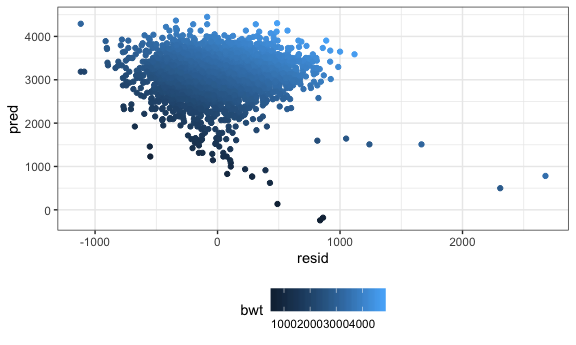

p8105\_hw6\_xy2397
================
Xue Yang
11/20/2018

Problem 1
---------

``` r
# load the data
homicide = read_csv(file = "./data/homicide-data.csv") 
```

``` r
homicide = 
  homicide %>% 
  # create a city_state variabl
  unite(city_state, city, state, sep = ",") %>% 
  # create a binary variable which "0" indicates homicide is unsolved, "1" solved
  mutate(resolved = as.numeric(disposition == "Closed by arrest"))  

homicide_df = 
  homicide %>%
  mutate(city_state = as.factor(city_state)) %>% 
  filter(!(city_state %in% c("Dallas,TX", "Phoenix,AZ", "Kansas City,MO", "Tulsa,AL"))) %>% 
  mutate(victim_race = ifelse(victim_race == "White", "white", "non-white"),
         victim_race = as.factor(victim_race),
         victim_race = relevel(victim_race, ref = "white"),
         victim_age = as.numeric(victim_age))
```

    ## Warning in evalq(as.numeric(victim_age), <environment>): NAs introduced by
    ## coercion

``` r
baltimore_df = 
  homicide_df %>% 
  filter(city_state == "Baltimore,MD") %>% 
  select(resolved, victim_race, victim_age, victim_sex)

fit = glm(resolved ~  victim_age + victim_sex + victim_race,
          data = baltimore_df,
          family = binomial)


fit %>% 
  broom::tidy() %>% 
  mutate(or = boot::inv.logit(estimate),
         OR = exp(estimate),
         conf_low = exp(confint(fit, level = 0.95))[,1],
         conf_high = exp(confint(fit, level = 0.95))[,2]) %>% 
  filter(term == "victim_racenon-white") %>% 
  mutate(city_state = "Baltimore,MD") %>% 
  knitr::kable(digits = 3)
```

    ## Waiting for profiling to be done...
    ## Waiting for profiling to be done...

| term                  |  estimate|  std.error|  statistic|  p.value|     or|     OR|  conf\_low|  conf\_high| city\_state  |
|:----------------------|---------:|----------:|----------:|--------:|------:|------:|----------:|-----------:|:-------------|
| victim\_racenon-white |     -0.82|      0.175|     -4.694|        0|  0.306|  0.441|      0.312|        0.62| Baltimore,MD |

``` r
logistic_fit = function(city){
  
  city_data = 
    homicide_df %>% 
    filter(city_state == city) %>% 
    select(resolved, victim_race, victim_age, victim_sex)

  
  fit = 
    glm(resolved ~ victim_age + victim_sex + victim_race, 
        data = city_data, 
        family = binomial) 
    
  
  result = 
    fit %>%
    broom::tidy() %>% 
    mutate(OR = exp(estimate),
           conf_low = exp(confint(fit, level = 0.95))[,1],
           conf_high = exp(confint(fit, level = 0.95))[,2]) %>% 
    filter(term == "victim_racenon-white") 
  
  result
  
}
```

``` r
city = 
  homicide_df %>% 
  count(city_state) %>% 
  unnest()


output = 
  tibble(city = city$city_state) %>% 
  mutate(estimates = purrr::map(.x = city, ~logistic_fit(city = .x))) %>%
  unnest() %>% 
  select(-term)

output %>% 
  knitr::kable(digits = 3)
```

| city              |  estimate|  std.error|  statistic|  p.value|     OR|  conf\_low|  conf\_high|
|:------------------|---------:|----------:|----------:|--------:|------:|----------:|-----------:|
| Albuquerque,NM    |    -0.299|      0.253|     -1.181|    0.238|  0.741|      0.449|       1.215|
| Atlanta,GA        |    -0.284|      0.284|     -1.000|    0.317|  0.753|      0.424|       1.299|
| Baltimore,MD      |    -0.820|      0.175|     -4.694|    0.000|  0.441|      0.312|       0.620|
| Baton Rouge,LA    |    -0.404|      0.387|     -1.044|    0.296|  0.668|      0.304|       1.405|
| Birmingham,AL     |     0.039|      0.268|      0.144|    0.886|  1.039|      0.612|       1.754|
| Boston,MA         |    -2.167|      0.453|     -4.784|    0.000|  0.115|      0.043|       0.259|
| Buffalo,NY        |    -0.942|      0.309|     -3.048|    0.002|  0.390|      0.210|       0.710|
| Charlotte,NC      |    -0.584|      0.282|     -2.072|    0.038|  0.558|      0.313|       0.951|
| Chicago,IL        |    -0.576|      0.135|     -4.257|    0.000|  0.562|      0.432|       0.734|
| Cincinnati,OH     |    -1.145|      0.280|     -4.092|    0.000|  0.318|      0.180|       0.541|
| Columbus,OH       |    -0.157|      0.152|     -1.030|    0.303|  0.855|      0.634|       1.153|
| Denver,CO         |    -0.508|      0.264|     -1.925|    0.054|  0.602|      0.358|       1.008|
| Detroit,MI        |    -0.429|      0.147|     -2.908|    0.004|  0.651|      0.487|       0.869|
| Durham,NC         |     0.003|      0.464|      0.006|    0.995|  1.003|      0.390|       2.452|
| Fort Worth,TX     |    -0.177|      0.211|     -0.840|    0.401|  0.838|      0.553|       1.264|
| Fresno,CA         |    -0.803|      0.339|     -2.373|    0.018|  0.448|      0.222|       0.846|
| Houston,TX        |    -0.136|      0.113|     -1.202|    0.230|  0.873|      0.698|       1.090|
| Indianapolis,IN   |    -0.684|      0.142|     -4.809|    0.000|  0.505|      0.381|       0.665|
| Jacksonville,FL   |    -0.418|      0.138|     -3.034|    0.002|  0.658|      0.502|       0.862|
| Las Vegas,NV      |    -0.280|      0.129|     -2.171|    0.030|  0.755|      0.586|       0.972|
| Long Beach,CA     |    -0.231|      0.366|     -0.631|    0.528|  0.794|      0.379|       1.606|
| Los Angeles,CA    |    -0.407|      0.164|     -2.481|    0.013|  0.666|      0.481|       0.916|
| Louisville,KY     |    -0.937|      0.211|     -4.432|    0.000|  0.392|      0.257|       0.590|
| Memphis,TN        |    -0.245|      0.205|     -1.200|    0.230|  0.782|      0.519|       1.160|
| Miami,FL          |    -0.551|      0.216|     -2.550|    0.011|  0.576|      0.377|       0.881|
| Milwaukee,wI      |    -0.458|      0.229|     -1.998|    0.046|  0.632|      0.398|       0.982|
| Minneapolis,MN    |    -0.437|      0.320|     -1.366|    0.172|  0.646|      0.341|       1.204|
| Nashville,TN      |    -0.107|      0.163|     -0.658|    0.511|  0.899|      0.652|       1.234|
| New Orleans,LA    |    -0.764|      0.234|     -3.268|    0.001|  0.466|      0.294|       0.737|
| New York,NY       |    -0.632|      0.328|     -1.926|    0.054|  0.531|      0.271|       0.988|
| Oakland,CA        |    -1.547|      0.364|     -4.249|    0.000|  0.213|      0.099|       0.418|
| Oklahoma City,OK  |    -0.384|      0.181|     -2.123|    0.034|  0.681|      0.477|       0.970|
| Omaha,NE          |    -1.778|      0.302|     -5.894|    0.000|  0.169|      0.091|       0.298|
| Philadelphia,PA   |    -0.440|      0.143|     -3.075|    0.002|  0.644|      0.485|       0.850|
| Pittsburgh,PA     |    -1.267|      0.286|     -4.432|    0.000|  0.282|      0.157|       0.485|
| Richmond,VA       |    -0.804|      0.519|     -1.549|    0.121|  0.447|      0.144|       1.150|
| Sacramento,CA     |    -0.248|      0.283|     -0.876|    0.381|  0.781|      0.443|       1.348|
| San Antonio,TX    |    -0.372|      0.205|     -1.815|    0.069|  0.689|      0.459|       1.026|
| San Bernardino,CA |    -0.128|      0.412|     -0.310|    0.756|  0.880|      0.394|       1.999|
| San Diego,CA      |    -0.727|      0.247|     -2.939|    0.003|  0.483|      0.294|       0.778|
| San Francisco,CA  |    -0.780|      0.233|     -3.353|    0.001|  0.458|      0.288|       0.719|
| Savannah,GA       |    -0.517|      0.386|     -1.340|    0.180|  0.596|      0.275|       1.258|
| St. Louis,MO      |    -0.550|      0.179|     -3.064|    0.002|  0.577|      0.405|       0.819|
| Stockton,CA       |    -0.979|      0.331|     -2.958|    0.003|  0.376|      0.193|       0.713|
| Tampa,FL          |     0.147|      0.347|      0.425|    0.671|  1.159|      0.585|       2.293|
| Tulsa,OK          |    -0.507|      0.193|     -2.632|    0.008|  0.602|      0.411|       0.876|
| Washington,DC     |    -0.673|      0.348|     -1.933|    0.053|  0.510|      0.250|       0.989|

``` r
output %>% 
  mutate(city = forcats::fct_reorder(city, OR)) %>% 
  ggplot(aes(x = city, y = OR, color = city)) +
  geom_errorbar(aes(ymin = conf_low, ymax = conf_high)) +
  labs(
    title = "ORs and CIs for City",
    x = "City",
    y = "ORs and CIs"
  ) +
  viridis::scale_color_viridis(
    name = "City",
    discrete = TRUE
  ) +
  theme(legend.position = "none") +
  theme(axis.text.x = element_text(angle = 90, hjust = 1)) 
```


Problem 2
---------

``` r
birthweight = read_csv(file = "./data/birthweight.csv") 
```

    ## Parsed with column specification:
    ## cols(
    ##   .default = col_integer(),
    ##   gaweeks = col_double(),
    ##   ppbmi = col_double(),
    ##   smoken = col_double()
    ## )

    ## See spec(...) for full column specifications.

``` r
# change some varibles from numeric to factors
birthweight %>% 
  mutate(babysex = as.factor(babysex),
         frace = as.factor(frace),
         malform = as.factor(malform),
         mrace = as.factor(mrace))  
```

    ## # A tibble: 4,342 x 20
    ##    babysex bhead blength   bwt delwt fincome frace gaweeks malform menarche
    ##    <fct>   <int>   <int> <int> <int>   <int> <fct>   <dbl> <fct>      <int>
    ##  1 2          34      51  3629   177      35 1        39.9 0             13
    ##  2 1          34      48  3062   156      65 2        25.9 0             14
    ##  3 2          36      50  3345   148      85 1        39.9 0             12
    ##  4 1          34      52  3062   157      55 1        40   0             14
    ##  5 2          34      52  3374   156       5 1        41.6 0             13
    ##  6 1          33      52  3374   129      55 1        40.7 0             12
    ##  7 2          33      46  2523   126      96 2        40.3 0             14
    ##  8 2          33      49  2778   140       5 1        37.4 0             12
    ##  9 1          36      52  3515   146      85 1        40.3 0             11
    ## 10 1          33      50  3459   169      75 2        40.7 0             12
    ## # ... with 4,332 more rows, and 10 more variables: mheight <int>,
    ## #   momage <int>, mrace <fct>, parity <int>, pnumlbw <int>, pnumsga <int>,
    ## #   ppbmi <dbl>, ppwt <int>, smoken <dbl>, wtgain <int>

``` r
birthweight %>% 
  ggplot(aes(x = bwt)) +
  geom_histogram() +
  labs(
    title = "Histogram of Birth Weight",
    x = "Birth Weight",
    y = "Frequency"
  )
```

    ## `stat_bin()` using `bins = 30`. Pick better value with `binwidth`.

 From the plot we can find that the distribution of "bwt" is not significant skewed, so we can assume the normality of it.

Then we focus on the linear relationship between each variables:

``` r
cor(birthweight)
```

    ## Warning in cor(birthweight): the standard deviation is zero

    ##               babysex        bhead      blength          bwt        delwt
    ## babysex   1.000000000 -0.168800453 -0.105288240 -0.086641788 -0.016419382
    ## bhead    -0.168800453  1.000000000  0.630454800  0.747106776  0.214370719
    ## blength  -0.105288240  0.630454800  1.000000000  0.743450753  0.229149444
    ## bwt      -0.086641788  0.747106776  0.743450753  1.000000000  0.287889306
    ## delwt    -0.016419382  0.214370719  0.229149444  0.287889306  1.000000000
    ## fincome  -0.022642956  0.115699146  0.078745057  0.154571511  0.034994354
    ## frace     0.030927740 -0.096080105 -0.113357087 -0.179390010 -0.064849608
    ## gaweeks   0.020240367  0.378456488  0.359263675  0.412183348  0.124278465
    ## malform  -0.018032531  0.002996998 -0.009021499  0.001333249  0.012094278
    ## menarche -0.006286522 -0.003016051 -0.021067386 -0.024424664 -0.085940103
    ## mheight   0.007735868  0.116948174  0.160259849  0.192163204  0.411257622
    ## momage   -0.037178242  0.108081296  0.080160314  0.135773400  0.074040925
    ## mrace     0.036021274 -0.110141965 -0.132483530 -0.207668944 -0.092238299
    ## parity    0.022998017 -0.020039523 -0.032470081 -0.008374112 -0.004709123
    ## pnumlbw            NA           NA           NA           NA           NA
    ## pnumsga            NA           NA           NA           NA           NA
    ## ppbmi    -0.006993810  0.086556495  0.074015773  0.093945729  0.720504055
    ## ppwt     -0.001007045  0.136608829  0.148604640  0.182891964  0.870913274
    ## smoken   -0.027754251 -0.053947231 -0.065628829 -0.075627807  0.048612734
    ## wtgain   -0.031461915  0.183333740  0.191223763  0.247252588  0.424788310
    ##               fincome       frace       gaweeks       malform
    ## babysex  -0.022642956  0.03092774  0.0202403675 -0.0180325312
    ## bhead     0.115699146 -0.09608011  0.3784564882  0.0029969977
    ## blength   0.078745057 -0.11335709  0.3592636747 -0.0090214992
    ## bwt       0.154571511 -0.17939001  0.4121833483  0.0013332488
    ## delwt     0.034994354 -0.06484961  0.1242784648  0.0120942777
    ## fincome   1.000000000 -0.28459212  0.1066776727 -0.0068882129
    ## frace    -0.284592120  1.00000000 -0.1137273091 -0.0268645071
    ## gaweeks   0.106677673 -0.11372731  1.0000000000 -0.0050945358
    ## malform  -0.006888213 -0.02686451 -0.0050945358  1.0000000000
    ## menarche -0.003535085  0.02121010 -0.0004362693 -0.0098672735
    ## mheight   0.131018596 -0.20087131  0.0621377387 -0.0079746200
    ## momage    0.323114207 -0.18693410  0.1139098271  0.0177280547
    ## mrace    -0.304811707  0.82860550 -0.1315205703 -0.0276627251
    ## parity   -0.025942406  0.00117668 -0.0796588545 -0.0013177624
    ## pnumlbw            NA          NA            NA            NA
    ## pnumsga            NA          NA            NA            NA
    ## ppbmi    -0.020189000  0.04594735  0.0273358740  0.0002545075
    ## ppwt      0.047252637 -0.05961396  0.0564730379 -0.0033798843
    ## smoken    0.077943047 -0.17293364  0.0362116820  0.0331602952
    ## wtgain   -0.016037706 -0.02177121  0.1481459581  0.0307670393
    ##               menarche      mheight      momage        mrace       parity
    ## babysex  -0.0062865218  0.007735868 -0.03717824  0.036021274  0.022998017
    ## bhead    -0.0030160515  0.116948174  0.10808130 -0.110141965 -0.020039523
    ## blength  -0.0210673863  0.160259849  0.08016031 -0.132483530 -0.032470081
    ## bwt      -0.0244246642  0.192163204  0.13577340 -0.207668944 -0.008374112
    ## delwt    -0.0859401032  0.411257622  0.07404092 -0.092238299 -0.004709123
    ## fincome  -0.0035350852  0.131018596  0.32311421 -0.304811707 -0.025942406
    ## frace     0.0212101015 -0.200871313 -0.18693410  0.828605502  0.001176680
    ## gaweeks  -0.0004362693  0.062137739  0.11390983 -0.131520570 -0.079658854
    ## malform  -0.0098672735 -0.007974620  0.01772805 -0.027662725 -0.001317762
    ## menarche  1.0000000000  0.074115569  0.17603797  0.013421835  0.019476194
    ## mheight   0.0741155687  1.000000000  0.10904804 -0.230425440 -0.013423739
    ## momage    0.1760379749  0.109048035  1.00000000 -0.211600003  0.051954243
    ## mrace     0.0134218348 -0.230425440 -0.21160000  1.000000000  0.002117682
    ## parity    0.0194761938 -0.013423739  0.05195424  0.002117682  1.000000000
    ## pnumlbw             NA           NA          NA           NA           NA
    ## pnumsga             NA           NA          NA           NA           NA
    ## ppbmi    -0.1218260802 -0.100737749  0.08124512  0.034843174 -0.005926674
    ## ppwt     -0.0704995875  0.426687241  0.12959210 -0.084248225 -0.011202947
    ## smoken    0.0163746450  0.060983516  0.07545435 -0.197517866 -0.005575698
    ## wtgain   -0.0445137226  0.048478926 -0.08848760 -0.031966724  0.011081927
    ##          pnumlbw pnumsga         ppbmi         ppwt       smoken
    ## babysex       NA      NA -0.0069938102 -0.001007045 -0.027754251
    ## bhead         NA      NA  0.0865564946  0.136608829 -0.053947231
    ## blength       NA      NA  0.0740157734  0.148604640 -0.065628829
    ## bwt           NA      NA  0.0939457290  0.182891964 -0.075627807
    ## delwt         NA      NA  0.7205040550  0.870913274  0.048612734
    ## fincome       NA      NA -0.0201890000  0.047252637  0.077943047
    ## frace         NA      NA  0.0459473547 -0.059613957 -0.172933640
    ## gaweeks       NA      NA  0.0273358740  0.056473038  0.036211682
    ## malform       NA      NA  0.0002545075 -0.003379884  0.033160295
    ## menarche      NA      NA -0.1218260802 -0.070499588  0.016374645
    ## mheight       NA      NA -0.1007377489  0.426687241  0.060983516
    ## momage        NA      NA  0.0812451229  0.129592098  0.075454350
    ## mrace         NA      NA  0.0348431735 -0.084248225 -0.197517866
    ## parity        NA      NA -0.0059266742 -0.011202947 -0.005575698
    ## pnumlbw        1      NA            NA           NA           NA
    ## pnumsga       NA       1            NA           NA           NA
    ## ppbmi         NA      NA  1.0000000000  0.853316763  0.007022980
    ## ppwt          NA      NA  0.8533167629  1.000000000  0.038854748
    ## smoken        NA      NA  0.0070229798  0.038854748  1.000000000
    ## wtgain        NA      NA -0.1099295765 -0.074940321  0.027065774
    ##               wtgain
    ## babysex  -0.03146191
    ## bhead     0.18333374
    ## blength   0.19122376
    ## bwt       0.24725259
    ## delwt     0.42478831
    ## fincome  -0.01603771
    ## frace    -0.02177121
    ## gaweeks   0.14814596
    ## malform   0.03076704
    ## menarche -0.04451372
    ## mheight   0.04847893
    ## momage   -0.08848760
    ## mrace    -0.03196672
    ## parity    0.01108193
    ## pnumlbw           NA
    ## pnumsga           NA
    ## ppbmi    -0.10992958
    ## ppwt     -0.07494032
    ## smoken    0.02706577
    ## wtgain    1.00000000

By looking at the correlation matrix of the full data, first we can find that there is no relationship between pnumlbw and pnumsga with other variables, so we can delete these two variables from the model.

Then we focus on the relationship between the outcome: "bwt" and other variables, we can find that there is high positive linear relationship between "bwt" and "bhead", "blength", and there is some small linear relationship between "bwt" and "gaweeks".

So in our model, we first use "bhead" and "blength" to be the two predictors.

``` r
fit1 = lm(bwt ~ bhead + blength, data = birthweight)

summary(fit1)
```

    ## 
    ## Call:
    ## lm(formula = bwt ~ bhead + blength, data = birthweight)
    ## 
    ## Residuals:
    ##      Min       1Q   Median       3Q      Max 
    ## -1116.99  -185.71    -8.95   182.38  2677.29 
    ## 
    ## Coefficients:
    ##              Estimate Std. Error t value Pr(>|t|)    
    ## (Intercept) -6029.620     95.821  -62.93   <2e-16 ***
    ## bhead         146.021      3.489   41.85   <2e-16 ***
    ## blength        85.030      2.076   40.95   <2e-16 ***
    ## ---
    ## Signif. codes:  0 '***' 0.001 '**' 0.01 '*' 0.05 '.' 0.1 ' ' 1
    ## 
    ## Residual standard error: 289.2 on 4339 degrees of freedom
    ## Multiple R-squared:  0.6813, Adjusted R-squared:  0.6812 
    ## F-statistic:  4639 on 2 and 4339 DF,  p-value: < 2.2e-16

``` r
fit1 %>% 
  broom::tidy() %>% 
  knitr::kable(digits = 3)
```

| term        |   estimate|  std.error|  statistic|  p.value|
|:------------|----------:|----------:|----------:|--------:|
| (Intercept) |  -6029.620|     95.821|    -62.926|        0|
| bhead       |    146.021|      3.489|     41.851|        0|
| blength     |     85.030|      2.076|     40.955|        0|

``` r
fit1 %>% 
  broom::glance() %>% 
  select(adj.r.squared)
```

    ## # A tibble: 1 x 1
    ##   adj.r.squared
    ## *         <dbl>
    ## 1         0.681

From the results of the MLR of the these 2 covariates, through the globel F-test:

*H*<sub>0</sub> : *β*<sub>1</sub> = *β*<sub>2</sub> = 0; *H*<sub>1</sub> : *a**t* *l**e**a**s**t* *o**n**e* *β*<sub>*i*</sub> ≠ 0

Since *F*<sub>*s**t**a**t*</sub> = 54.47, *p* − *v**a**l**u**e* &lt; 2.2*e* − 16, so we have enough evidence to reject the null and conclude that there is a regression relation between the outcome "bwt" and these 2 covariates.

We can also focus on the Adjusted *R*<sup>2</sup>: 0.6812, it means that 68.12% of the variation in the outcome "bwt" is explained by linear association with the "bhead" and "blength".

In conclusion, this is a great model.

``` r
birthweight %>% 
  select(bwt, bhead, blength) %>% 
  modelr::add_residuals(fit1) %>% 
  modelr::add_predictions(fit1) %>% 
  ggplot(aes(x = resid, y = pred, color = bwt)) + geom_point()
```


We can also use bootstrap to simulate and drawing repeatedly from the original population.

``` r
birthweight %>% 
  modelr::bootstrap(n = 1000) %>% 
  mutate(models = map(strap, ~ lm(bwt ~ bhead + blength, data = .x)),
         results = map(models, broom::tidy)
         #pred =  map(models, ~ modelr::add_predictions),
         #resid = map(models, ~ modelr::add_residuals)
         ) %>% 
  select(results) %>% 
  unnest() %>% 
  group_by(term) %>% 
  summarize(boot_se = sd(estimate)) 
```

    ## # A tibble: 3 x 2
    ##   term        boot_se
    ##   <chr>         <dbl>
    ## 1 (Intercept)  136.  
    ## 2 bhead          6.59
    ## 3 blength        4.89

``` r
fit1 = lm(bwt ~ bhead + blength, data = birthweight)
fit2 = lm(bwt ~ blength + gaweeks, data = birthweight)
fit3 = lm(bwt ~ bhead + blength + babysex + bhead * blength + bhead * babysex + blength * babysex
          + bhead * blength * babysex, data = birthweight)
```

``` r
cv_df = 
  crossv_mc(birthweight, 100) %>% 
  mutate(train = map(train, as_tibble),
         test = map(test, as_tibble)) %>% 
  mutate(fit1 = map(train, ~lm(bwt ~ bhead + blength, data = .x)),
         fit2 = map(train, ~lm(bwt ~ blength + gaweeks, data = .x)),
         fit3 = map(train, ~lm(bwt ~ bhead + blength + babysex + bhead * blength + 
                                 bhead * babysex + blength * babysex + 
                                 bhead * blength * babysex, data = .x))) %>% 
  mutate(rmse_fit1 = map2_dbl(fit1, test, ~rmse(model = .x, data = .y)),
         rmse_fit2 = map2_dbl(fit2, test, ~rmse(model = .x, data = .y)),
         rmse_fit3 = map2_dbl(fit3, test, ~rmse(model = .x, data = .y)))
```

``` r
cv_df %>% 
  select(.id, starts_with("rmse")) %>% 
  gather(key = model, value = rmse, rmse_fit1:rmse_fit3) %>% 
  mutate(model = str_replace(model, "rmse_", ""),
         model = fct_inorder(model)) %>% 
  ggplot(aes(x = model, y = rmse)) + geom_violin()
```


